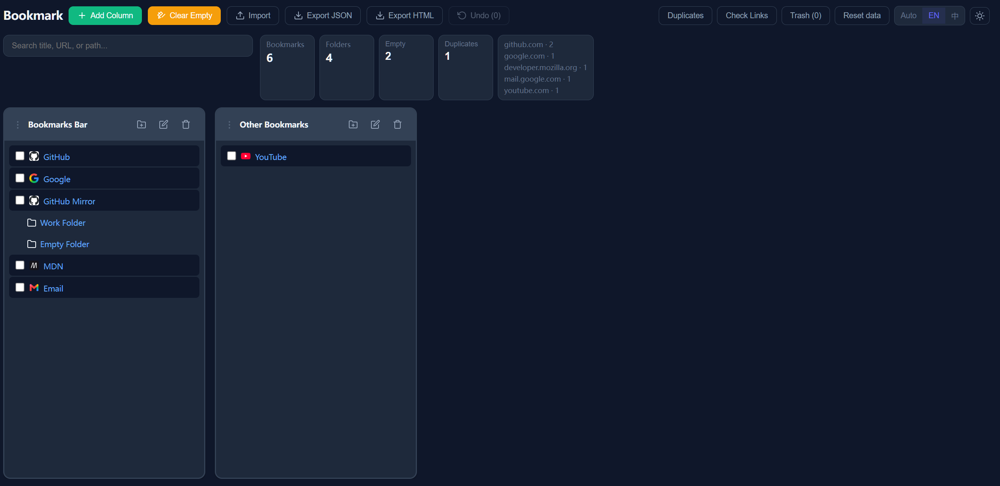
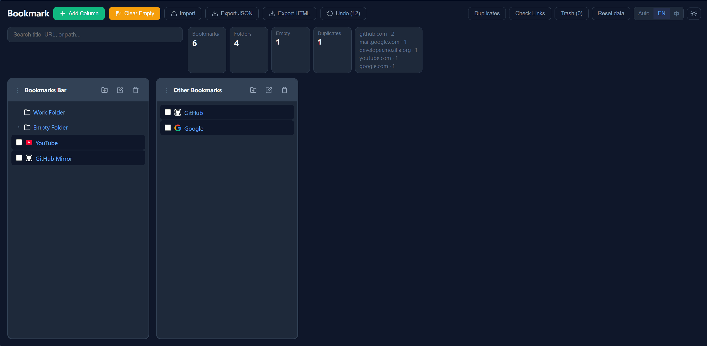

<p align="center">
  
</p>

<div align="center">

[简体中文](README.md) · [English](README.en.md)

</div>

# Bookmark Web

> 离线书签管理器 —— 纯静态网页应用，数据保存在浏览器本地。

无需安装任何扩展，打开网页即可使用。所有数据保存在浏览器 `localStorage`，不会上传到服务器。适合不想安装扩展、或使用不支持 Chrome 扩展的浏览器（如 Safari、其他浏览器）的用户

[点击即可体验](https://hiueetr.github.io/Bookmark-Web/)

## 功能

### 浏览与导航

- 多列浏览书签文件夹，支持新增 / 移除列
- 列宽可调整，列顺序可拖拽
- 书签详情侧栏，显示路径、URL、添加时间并支持复制 URL



### 整理

- 拖拽移动书签，支持拖到具体位置排序
- 批量选择、批量移动和批量删除
- 移动撤销栈，支持撤销单个或批量移动
- 编辑书签标题和 URL，重命名文件夹
- 清理空文件夹，采用"勾选即删除"的安全语义
- 根文件夹保护（默认根文件夹不可删除）



### 搜索

- 全局搜索标题、URL 和路径，并可定位到所在文件夹

### 检查

- 重复书签扫描，按标准化 URL 分组
- 手动链接检查，最多检查 50 个目标并区分正常、失效和未知

### 数据

- JSON 与 Netscape HTML 书签导入 / 导出
- 回收站备份，删除前保存可恢复副本
- 首次进入引导界面（导入文件或加载示例数据）
- "重置数据"功能（清空本地存储的所有书签，不可撤销）

### 个性化

- 主题切换（亮色 / 暗色）
- 中英双语界面

## 技术栈

| 类别     | 技术                                    |
| -------- | --------------------------------------- |
| 框架     | React 18 + TypeScript 5                 |
| 构建     | Vite 5（支持子路径部署）                |
| 部署     | GitHub Pages（GitHub Actions 自动部署） |
| 测试     | Vitest 4                                |
| 代码规范 | ESLint 10                               |

## 开发

```powershell
npm install
npm run dev
```

## 构建

```powershell
npm run build
```

## 验证命令

```powershell
npm run typecheck   # 类型检查
npm run lint         # 代码规范检查
npm test             # 运行单元测试
npm run build        # 构建
```

## 项目结构

```
Bookmark-Web/
├── src/
│   ├── components/         # React 组件（TreeView、各种 Modal、WelcomeScreen 等）
│   ├── context/            # I18n 与主题 Context
│   ├── i18n/               # 中英文翻译
│   ├── lib/                # 书签、存储、导入导出、清理等核心逻辑
│   ├── styles/             # CSS 样式（app.css、themes.css）
│   ├── types/              # TypeScript 类型定义
│   ├── App.tsx             # 主应用
│   ├── main.tsx            # 入口
│   └── styles.css          # 全局样式
├── public/icons/           # 图标
├── .github/workflows/      # GitHub Actions 工作流
├── vite.config.ts          # 支持 VITE_BASE_PATH 子路径
└── tsconfig.json
```

## 数据存储

书签数据保存在浏览器的 `localStorage` 中：

| 键                       | 用途          |
| ------------------------ | ------------- |
| `bookmark-web-tree`    | 书签树结构    |
| `bookmark-web-next-id` | 下一个书签 id |
| `bookmark-state`       | 列布局        |
| `bookmark-trash`       | 回收站数据    |
| `bookmark-theme`       | 主题设置      |
| `bookmark-locale`      | 语言设置      |

## 已知限制

- 失效链接检查受 CORS、站点策略和网络环境影响，未知状态需要人工确认
- 回收站恢复会尽量恢复到原父文件夹；如果原父文件夹不存在，恢复可能失败
- 大书签库优化以过滤、派生数据 memo、限制搜索结果和减少全量刷新为主，尚未引入第三方虚拟滚动库
- 单个浏览器的 `localStorage` 容量有限（通常 5-10MB），超大量书签库可能遇到存储限制

## 相关项目

- [Bookmark-Extension](https://github.com/HIUEETR/Bookmark-extension)：浏览器扩展版本，直接管理 Chrome / Edge 原生书签，使用 `chrome.bookmarks` API，支持在浏览器书签栏中原生显示

## license

Apache-2.0 license
